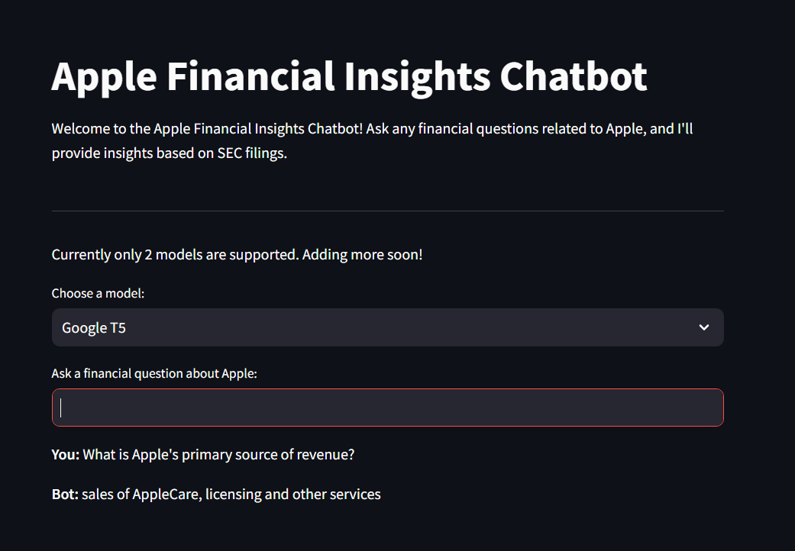
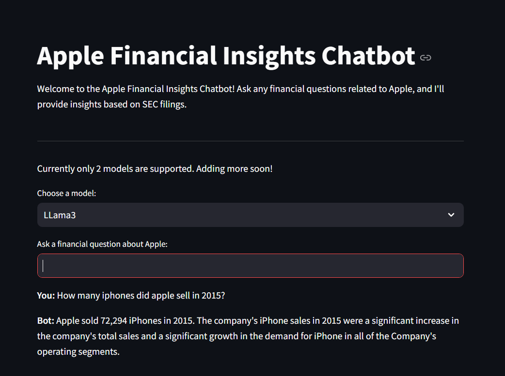

# Apple Financial Insights Chatbot

Welcome to the Apple Financial Insights Chatbot! This project provides a real-time query-response chatbox that answers financial questions related to Apple based on SEC filings. The chatbot is powered by two models: Google Flan-T5 and Llama (via llama-cpp).

## Features

- **Real-time Query-Response**: Ask financial questions about Apple and get insights based on SEC filings.
- **Multiple Models**: Choose between Google Flan-T5 and Llama models for generating responses.
- **Efficient Retrieval**: Uses FAISS for efficient similarity search and retrieval of relevant information.

## Setup Instructions

### Prerequisites

- Python 3.8 or higher
- Git

### Installation

1. **Clone the repository**:
    ```sh
    git clone https://github.com/your-username/apple-financial-insights-chatbot.git
    cd apple-financial-insights-chatbot
    ```

2. **Create a virtual environment**:
    ```sh
    python -m venv venv
    source venv/bin/activate  # On Windows, use `venv\Scripts\activate`
    ```

3. **Install dependencies**:
    ```sh
    pip install -r requirements.txt
    ```

### Running the Application

1. **Run the Streamlit application**:
    ```sh
    streamlit run app.py
    ```

2. **Interact with the chatbot**: Open your web browser and navigate to `http://localhost:8501` to start asking financial questions about Apple.

## Usage

- **Ask Questions**: Type your financial questions about Apple in the input box and press Enter.
- **View Responses**: The chatbot will provide responses based on SEC filings, displayed below the input box.

## Screenshots

### Google Flan-T5 Model



### Llama3 Model



## Project Structure

- `app.py`: Entry point for the Streamlit application.
- `chat.py`: Handles the chat interface and interactions.
- `google_t5_model.py`: Loads and uses the Google Flan-T5 model.
- `llama_model.py`: Loads and uses the Llama model via llama-cpp.
- `data_processing.py`: Handles downloading and preprocessing of SEC filings.
- `requirements.txt`: Lists all the dependencies required for the project.

## Acknowledgements

- [Streamlit](https://streamlit.io/)
- [Transformers](https://huggingface.co/transformers/)
- [Sentence-Transformers](https://www.sbert.net/)
- [FAISS](https://github.com/facebookresearch/faiss)
- [llama-cpp-python](https://llama-cpp-python.readthedocs.io/en/latest/)
